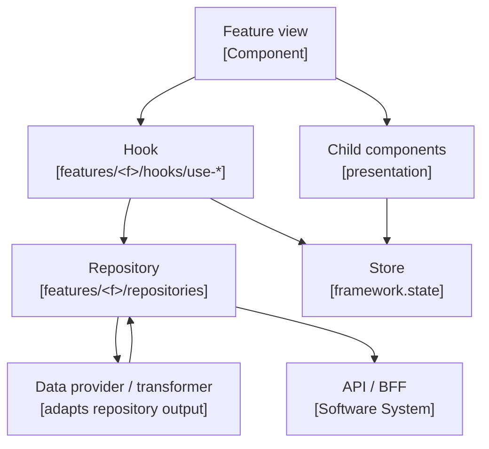
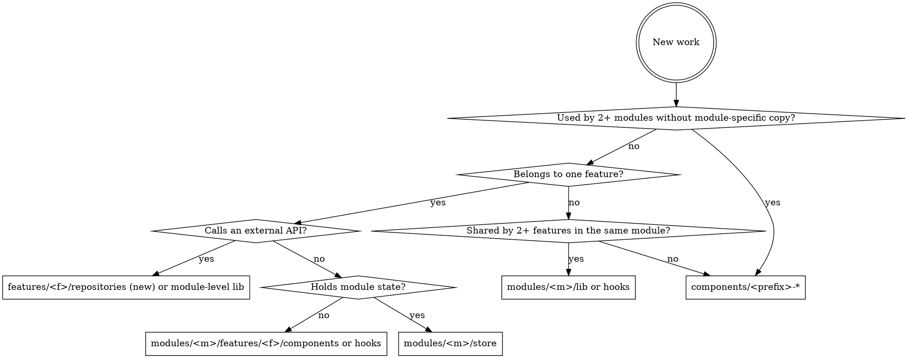

# Architecture

This skill captures the **frontend** architecture for a modular, bulletproof-react
codebase: which directories exist, how a feature is layered, and which boundaries are
enforced as `dependency-cruiser` errors. Every concrete path is resolved through the
profile (`architecture.source_root`, `architecture.modules`, `architecture.component_prefix`,
`architecture.path_aliases`) rather than hardcoded — the same rules hold whether the
source root is a feature-module SPA or a flat component library.

## Profile keys consumed

- `architecture.source_root`
- `architecture.modules`
- `architecture.component_prefix`
- `architecture.path_aliases`
- `framework.state`
- `framework.di`
- `make.lint_deps`
- `make.format`
- `make.lint`
- `quality.depcruise_violations`

## Layered architecture (the one flow to internalize)

Every feature follows the same **Component → Hook → Repository → API** flow. The
repository hides which backend service answered; the hook owns UI logic and state; the
component only renders.



Read the layers top to bottom:

1. **Components** (`features/<feature>/components/`) — presentation only. They consume
   hooks and render children; they never import repositories, the module store, or the
   shared services layer directly.
2. **Hooks** (`features/<feature>/hooks/use-*.ts`) — UI logic, state access
   (`framework.state`), and the only place that calls repository APIs and dispatches
   mutations.
3. **Data providers / transformers** — adapt repository output to the shape the UI needs.
   They live next to the repository they wrap.
4. **Repositories** (`features/<feature>/repositories/`) — the only layer allowed to talk
   to the shared HTTP client under `<architecture.source_root>/services/`. Exposed through
   their `index` file; internal files are private.
5. **API gateway / backend** — the frontend never calls a microservice directly. It calls
   the project's backend (a BFF / API gateway), and the repository layer hides which
   service answered. Each backend owns its own storage and cache — implementation details
   the frontend must not encode.

## Boundary rules (dependency-cruiser, severity `error`)

These come from the repository's dependency-cruiser config and run on every PR via the
target mapped by `make.lint_deps`. Internalize them before placing a file. Rule names are
the stack-generic bulletproof-react boundary set; a given repo enables the subset that
matches its layout.

**Module and feature isolation:**

- `no-cross-module-imports` — one module importing another module's internals.
- `no-cross-feature-imports` — sibling features in the same module importing each other.
  Use the module's shared `hooks/`, `lib/`, `store/`, `types/`, or `utils/`.
- `no-components-import-modules` — shared `components/*` depending on any module.

**Repository boundary:**

- `no-repository-internal-imports` — reaching past a repository's `index` file.
- `no-repositories-to-ui-hooks` — repositories depending on feature `components/`,
  `hooks/`, `routes/`, or module `hooks/` / `store/`.
- `no-feature-direct-http-client` — anything outside `repositories/` importing the shared
  HTTP client in `<architecture.source_root>/services/`.
- `no-store-direct-http-client` — module `store/` importing the shared HTTP client.

**UI layering:**

- `no-feature-ui-to-services` — feature `components/`, `hooks/`, `routes/` importing the
  services layer.
- `no-components-to-repositories` — components importing repositories directly (go through
  a hook).
- `no-components-to-store` — components importing the module store directly. Exception:
  hook files (`use-*.ts`).
- `no-store-to-feature-ui` — module store importing feature `components/`, `hooks/`,
  `routes/`.
- `no-lib-to-features` — module `lib/` depending on its own `features/`.

**DI containment (applies when `framework.di` is set):**

- `no-tsyringe-outside-di-and-repositories` — DI-container imports outside the composition
  root, repositories, services, stores, error utils, and module store mappers.
- `no-di-config-import-outside-composition-root` — importing the DI composition-root config
  outside the app entry points and the permitted store files.

**Folder shape:**

- `module-allowed-folders` — module root may only contain `config`, `features`, `hooks`,
  `lib`, `store`, `types`, `utils`.
- `feature-allowed-folders` — feature root may only contain `assets`, `components`,
  `hooks`, `i18n`, `repositories`, `routes`, `stores`, `types`, `utils`.
- `feature-hooks-file-convention` — files inside `features/*/hooks/` must be `index.*` or
  `use-<kebab>.*`.

**Type-only files:**

- `type-files-imported-as-type-only` — `types.ts` and `types/` folders may only be imported
  with `import type`.
- `type-files-no-runtime-imports` — type-only files must not depend on runtime modules.

**Naming:**

- `no-uppercase-paths`, `src-module-name-kebab-case`, `src-feature-name-kebab-case` — no
  uppercase letters in any source or test path.

When the target mapped by `make.lint_deps` reports a violation, the fix is almost always to
introduce or use the missing layer (a hook, a repository public re-export), never to
silence the rule. Treat the boundary as binding even on a repo that ships no
dependency-cruiser config.

## Degrade rule (capability absent)

- If `make.lint_deps` is `null`, the automated boundary check is absent — note the skip and
  apply these rules as a manual review discipline before commit; fall back to the targets
  mapped by `make.format` and `make.lint` instead of inventing a `dependency-cruiser`
  invocation.
- If `architecture.modules` is empty (a flat component library with no `<source_root>/modules`),
  the module/feature isolation rules do not apply — the layout reduces to the shared
  component layer plus the repository boundary. Place primitives under
  `<architecture.source_root>/components/` and keep any API access behind a repository.

## Placement decision



When the placement is non-obvious, stop and re-read the boundary rules — the violation is
usually telling you the layer you skipped.

## Frontend module catalog

Every module is a directory under `<architecture.source_root>/modules/<kebab>/`, and its
name appears in `architecture.modules`. Names are lowercase kebab-case (enforced by
`src-module-name-kebab-case`). Shared UI lives in `<architecture.source_root>/components/`
under the `architecture.component_prefix` (e.g. `UI` → a `ui-button/index.tsx` exporting
`UIButton`).

Module composition (a parent module mounting a sub-module) is the **only** place
sub-module imports are allowed. Everything else must go through `modules/<m>/lib/`,
`store/`, `types/`, or `utils/`, or through the public exports of another module — never a
deep import past a module or repository boundary.

A module root holds only `config`, `features`, `hooks`, `lib`, `store`, `types`, `utils`;
a feature root holds only `assets`, `components`, `hooks`, `i18n`, `repositories`, `routes`,
`stores`, `types`, `utils`. Each feature view pairs with a typed DTO in its `types/` folder
— the DTO is the shape the repository returns, and the component never sees the raw API
response.

## Path aliases

Follow the bulletproof-react import convention; the configured aliases are listed in
`architecture.path_aliases` and wired into the TypeScript config, the bundler, and Jest.

- `./X` for same-folder imports.
- A project-wide alias (e.g. `@/...`) for cross-folder / cross-feature imports.
- An optional feature-scoped alias (e.g. `@auth/...`) for a deeply nested feature subtree,
  so imports stay readable and within the line-length budget. Use the feature-scoped alias
  whenever the target lives under that feature, regardless of where the importer lives.
- Avoid deep relative chains like `../../../X` — reach for an alias instead.

## Verification

```bash # profile-example
make lint-deps   # the target mapped by make.lint_deps (dependency-cruiser)
```

Run the target mapped by `make.lint_deps`. Treat any error as the architecture telling you
something is in the wrong layer: fix the import path or move the file. The
`quality.depcruise_violations` ceiling is fixed at `0` — never weaken the
dependency-cruiser config to make a violation pass.

For broader checks before commit, run the targets mapped by `make.format` then `make.lint`.

```yaml # profile-example
# Upstream reference profile values this skill reads:
architecture:
  source_root: src
  modules: [catalog, checkout]   # >=1 module dir under <source_root>/modules; [] = flat library
  component_prefix: UI           # ui-button/index.tsx exports UIButton
  path_aliases: ["@/", "@auth/"] # project-wide alias + feature-scoped alias
framework:
  state: zustand
  di: tsyringe
make:
  lint_deps: lint-deps           # or lint-dep-cruiser; null = no automated boundary check
  format: format
  lint: lint
quality:
  depcruise_violations: 0        # fixed ceiling
```

## Common mistakes

- `no-feature-direct-http-client` fires — a component or hook is calling the HTTP client
  itself. Move the call into a repository and consume it through a hook.
- `no-components-to-store` fires on a component — it imports the store directly. Expose
  state through a `use-*.ts` selector hook and import that.
- `no-cross-feature-imports` fires — one feature reaches into a sibling feature's
  `components/` or `hooks/`. Promote the shared code to `modules/<m>/lib/` or `hooks/`.
- `feature-hooks-file-convention` fires — a non-hook file (helper, types) was placed inside
  `hooks/`. Move it to `utils/`, `types/`, or `lib/`.
- `module-allowed-folders` fires on a stray folder — an old layout is still in use. Rename
  to one of the allowed module folders (`lib/`, `utils/`).
- A repository imports from `hooks/` or `components/` — mapping logic crept into the wrong
  layer. Move the mapping into the repository or a dedicated transformer.
- Need to share state across modules — wrong layer. Modules are isolated by design; lift to
  a shared store or expose a hook from the owning module.

## Related skills

- [code-organization](../code-organization/SKILL.md) — kebab-case naming, module / feature
  folder lists, file placement and naming.
- [frontend-component-development](../frontend-component-development/SKILL.md) — how to
  build the component and hook layers.
- [complexity-management](../complexity-management/SKILL.md) — when a boundary fix forces a
  file split to stay under the metrics gate.
- [observability-instrumentation](../observability-instrumentation/SKILL.md) — where to add
  web-vitals, structured logs, and error reporting along the layered flow.
- [code-review](../code-review/SKILL.md) — what to flag when a PR crosses an architectural
  boundary.
